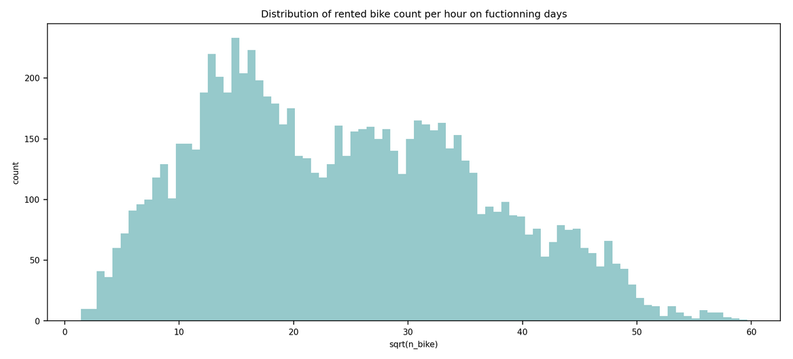

# Python_For_Data_Analysis_Seoul_Bike

## Important

This markdown only summarize the notebook I made. It does not reflect the whole process. I only aims to answer the question "What has been finally done?" bu not how or why. For instance, I will not speak about GridSearch here. 
To see the full notebook you can refer to :
- The true notebook : [Axel_THEVENOT_Python_For_Data_Analysis.ipynb](https://github.com/AxelThevenot/Python_For_Data_Analysis_Seoul_Bike/blob/main/Axel_THEVENOT_Python_For_Data_Analysis.ipynb)
- Its HTML version : [Axel_THEVENOT_Python_For_Data_Analysis.html](https://github.com/AxelThevenot/Python_For_Data_Analysis_Seoul_Bike/blob/main/Notebook%20HTML/Axel_THEVENOT_Python_For_Data_Analysis.html)
- Its HTML version without input you can read as a full report of the project : [Axel_THEVENOT_Python_For_Data_Analysis_report.html](https://github.com/AxelThevenot/Python_For_Data_Analysis_Seoul_Bike/blob/main/Notebook%20HTML/Axel_THEVENOT_Python_For_Data_Analysis_report.html)


## How to use the API

### Feature matrix creation

On the client side, it will be ask to create a matrix of features to predict. Each row is a list of ordered features as following :

|**Feature**| **Format**|
|:-:|:-:|
| Date | dd/mm/yyyy|
| Hour | int|
| Temperature | °C|
| Humidity | %|
| Wind speed | m/s|
| Visibility | 10m|
| Dew point temperature | °C|
| Solar Radiation | MJ/m2|
| Rainfal | mm|
| Snowfall | mm|
| Seasons | {"Winter", "Autumn", "Spring", "Summer"}|
| Holiday | {"Holiday", "No Holiday"}|

### Run the API

We can run this server from terminal running the `python deployed_model.py` or `python3 deployed_model.py` according to your OS and python version.


### Request the API

From the **preprocessing.py** file I recreate the preprocessing function :
- set holiday feautre as boolean 
- extract time features
- trasnform meteorological arguments
- complete preprocessing with one hot encoding on categorical feautures and norm/standardization on numerical ones``

```python
import requests
from preprocessing import preprocess

X = None  # Matrix of raw features
url = 'http://localhost:5000/predict'  # API request url

def serialize(df):
    return [[value for value in row] for row in df.values]
    
# preprocess de feature matrix
X = serialize(preprocess(X))
# request the API
r = requests.post(url, json={'inputs': serialize(X)})

# get the predictions
prediction = r.json()
```

## Objectives

My [Iranian churn dataset](https://archive.ics.uci.edu/ml/datasets/Iranian+Churn+Dataset) was missing so I decided to choose the [Seoul bike sharing demand dataset](https://archive.ics.uci.edu/ml/datasets/Seoul+Bike+Sharing+Demand) dataset found on *UC Irvine Machine Learning Repository*.

**Abstract**

The dataset contains count of public bikes rented at each hour in Seoul Bike haring System with the corresponding Weather data and Holidays information.

**Data Set Information**

Currently Rental bikes are introduced in many urban cities for the enhancement of mobility comfort. It is important to make the rental bike available and accessible to the public at the right time as it lessens the waiting time. Eventually, providing the city with a stable supply of rental bikes becomes a major concern. The crucial part is the prediction of bike count required at each hour for the stable supply of rental bikes.
The dataset contains weather information (Temperature, Humidity, Windspeed, Visibility, Dewpoint, Solar radiation, Snowfall, Rainfall), the number of bikes rented per hour and date information.


The objective of the notebook is to analyze the dataset I get assigned and to make from there:
1. A powerpoint explaining the ins and outs of the problem, my reflections on the question raised, the different variables I have created, how the problem fits into the context of the study. In this case, I will try to predict the number of bikes rented in Seoul based on temporal and meteorological features. 
2. A python code : 
    - Data-visualization - showing the link between the variables and the target 
    - Modeling - take scikit-learn and try several algorithms, change hyper parameters, make a search grid, compare results of my models in graphs.
3. Transformation of the model into a Django of Flask API 


## Feautures preprocessing

**Rented Bike Count:** 


**Date:** Extract date informations :
- year number
- month name
- day number
- week day name
- working day condition


**Season:** Unchanged


**Holiday:** Unchanged


**Temperature and Dew point temperature:** Unchanged


**Humidity:** Unchanged


**Wind:** 


**Solar Radiation:** 


**Rainfall:** changed to dryness on the two lasts hours 
{

**Snowfall:** changed to snowing condition on the 8 lasts hours  0 \text{   else 0}">


**Visibility:** changed to loosed visibility compared to default 


**hour, season, month, day, week_day:** to dummies 

**n_bike, temp, wind, dew:** Standardization 

**hum, solar, dryness:** Normalization 


## Selected model

### Model comparison

For each following models I performed the same process :
   - LinearRegression
   - ElasticNet
   - HuberRegressor
   - BayesianRidge
   - ARDRegression
   - KNeighborsRegressor
   - RandomForestRegressor

For each dataset in {transformed dataset, untransformed dataset}:
For each model :
- Grid search on hyperparameters (if needed) ON THE TRAINING SET
- Get the best hyperparameters for the model
- Compute the RMSE on the prediction ON THE TEST SET


### RandomForestRegressor


**Model Name:** RandomForestRegressor
<br/>**Description:** A random forest is a meta estimator that fits a number of classifying decision trees on various sub-samples of the dataset and uses averaging to improve the predictive accuracy and control over-fitting.
<br/>**Prevents Overfitting:** yes 
<br/>**Handles Outliers:** yes 
<br/>**Handles several features:** yes 
<br/>**Adaptive Regularization:** no 
<br/>**Large Dataset:** yes 
<br/>**Non linear:** yes 
<br/>**Interpretability Score:** 3 / 5
<br/>**When to Use:** Nonlinear data groups in buckets 
<br/>**When to Use Expanded:** 
<br/>$\qquad$- Data is not linear and is composed more of "buckets" 
<br/>$\qquad$- Number of samples > number of features 
<br/>$\qquad$- There are dependent features in the input data. DTR handles these correlations well. 
<br/>**Advantages:** 
- Can export tree structure to see which features the tree is splitting on 
- Handles sparse and correlated data well 
- Able to tune the model to help with overfitting problem
<br/>**Disadvantages:** 
- Prediction accuracy on complex problems is usually inferior to gradient-boosted trees. 
- A forest is less interpretable than a single decision tree.
<br/>**Sklearn Package:** tree 
<br/>**Required Args:** None 
<br/>**Helpful Args:** criterion and max_depth 
<br/>**Variations:** gradient-boosted trees 

>**Grid Search:**
>
>**n_estimators:** int, default=100
><br/>The number of trees in the forest.
>
>**criterion:** str, default=”mse”
><br/>The function to measure the quality of a split. Supported criteria are “mse” for the mean squared error, which is equal to variance reduction as feature selection criterion, and “mae” for the mean absolute error.
>
>**max_depth:** int, default=None
><br/>The maximum depth of the tree. If None, then nodes are expanded until all leaves are pure or until all leaves contain less than min_samples_split samples.
>
>**max_features:** str, int or float, default=”auto”
><br/>The number of features to consider when looking for the best split.


